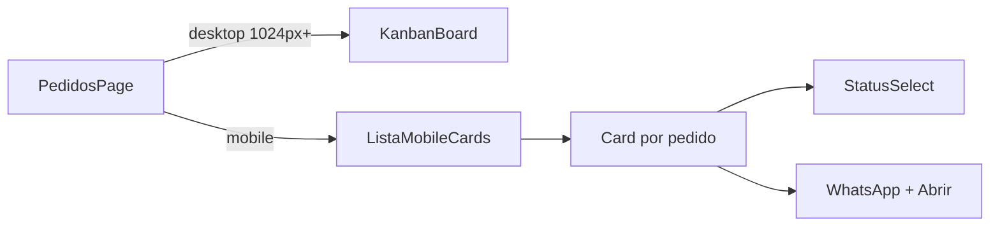

# Adaptar pedidos admin para celular

## Problema

Em [`src/routes/admin.pedidos.index.tsx`](src/routes/admin.pedidos.index.tsx), abaixo de 1024px (`useIsDesktop`) a UI já troca Kanban por lista, mas `ListaMobile` ainda renderiza uma **tabela de 5 colunas** (número, igreja, data, status, ações). No celular isso força scroll horizontal, comprime o `StatusSelect` (`w-[150px]`) e dificulta tocar em WhatsApp / Abrir.

`/meus-pedidos` já é card-based e usável no celular — não precisa mudar.

## Abordagem

Reescrever só `ListaMobile` (e o cabeçalho de filtros no mobile) no mesmo arquivo, sem alterar a API nem o Kanban desktop.

## Mudanças em [`admin.pedidos.index.tsx`](src/routes/admin.pedidos.index.tsx)

1. **Filtros mobile** — manter os chips de status; tornar a linha `overflow-x-auto` com `flex-nowrap` e `shrink-0` para rolar horizontalmente sem quebrar layout.

2. **`ListaMobile` → cards** — trocar `<table>` por lista de cards (`space-y-3`), cada um com:
   - Linha 1: número + igreja (truncate)
   - Linha 2: data em texto menor
   - Linha 3: `StatusSelect` em largura fluida (`w-full` / `min-w-0`) + botões WhatsApp e Abrir com área de toque adequada
   - Card inteiro ou botão “Abrir” levando a `/admin/pedidos/$id` (manter comportamento atual)

3. **`StatusSelect`** — no mobile, `SelectTrigger` com `w-full` em vez de `w-[150px]` (prop ou classe condicional) para caber no card.

4. **Empty / loading** — manter estados já existentes; opcionalmente skeleton em cards em vez de um bloco único.

## Fora de escopo

- Kanban desktop
- `/meus-pedidos` e `/pedido/$numero` (já ok no mobile)
- Detalhe admin `/admin/pedidos/$id` (já empilha com `lg:grid-cols`)

## Verificação

Abrir `/admin/pedidos` em viewport &lt; 1024px: filtros roláveis, cards legíveis, mudar status e abrir pedido sem scroll horizontal.