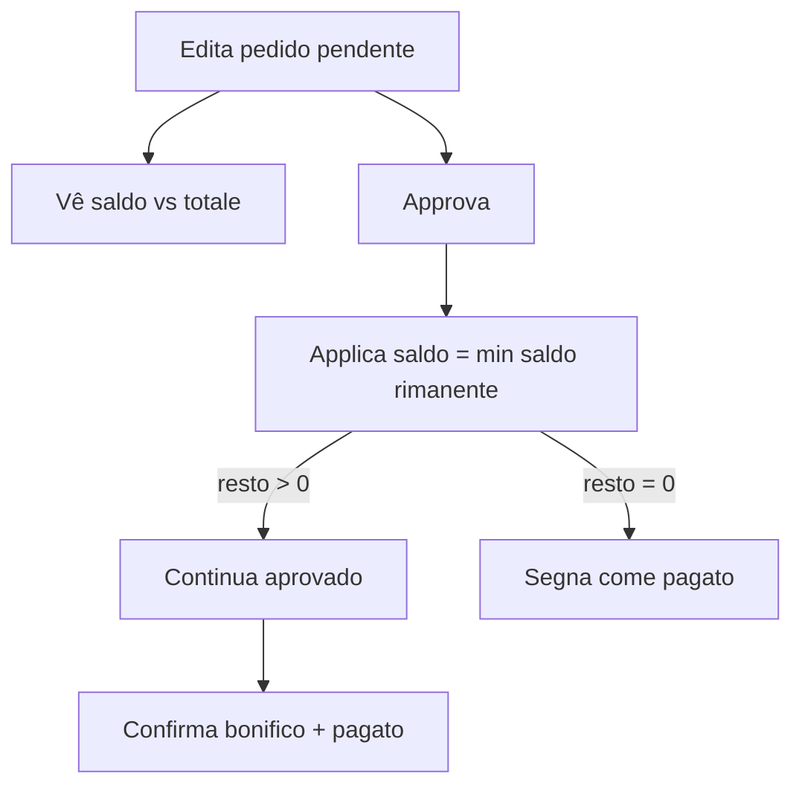

# Saldo visível na edição + cálculo automático no pagamento

Escopo: só UI/lógica em [`src/routes/admin.pedidos.$id.tsx`](src/routes/admin.pedidos.$id.tsx) (server fns de aplicar saldo já aceitam o valor; não muda schema).

## 1. Saldo sempre visível no detalhe admin

No bloco **Chiesa** (grid superior) e/ou no aside **Azioni**, mostrar **Saldo disponibile** em qualquer status (não só `aprovado`):

```
Saldo chiesa: € X,XX
```

Assim, ao editar um pedido `pendente`, o admin já vê o crédito da igreja.

## 2. Durante a edição (`EditarPedidoForm`)

Passar `saldoIgreja` para o formulário. Abaixo do totale live (já existe via `preco × qty`):

- Totale ordine (estimado)
- Saldo disponibile
- Se totale ≤ saldo: “Copribile interamente dal saldo”
- Se totale > saldo: “Dal saldo: €S · Da bonifico: €(T−S)”

Só informativo — débito continua só após aprovação, na fase de pagamento.

## 3. Pagamento: conta automática (sem digitar valor)

Substituir o input manual “Usa dal saldo” por cálculo `maxAplicavel = min(saldoIgreja, rimanente)`:

- Resumo automático: Totale / Già dal saldo / Applicabile ora / Rimanente dopo
- Botão único **“Applica saldo (€X)”** que chama `adminAplicarSaldoPedido` com `valor = maxAplicavel` (sem campo numérico)
- Se `maxAplicavel === 0`, botão desabilitado com a mensagem atual
- Checkbox de bonifico + “Segna come pagato” permanecem como hoje (resto > 0 exige confirmação)



## Arquivos

- [`src/routes/admin.pedidos.$id.tsx`](src/routes/admin.pedidos.$id.tsx) — única mudança necessária
- Sem alteração em `adminAplicarSaldoPedido` / migration
