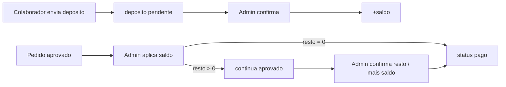

# Depósitos antecipados e saldo por igreja

Decisões fechadas:
- Depósito sobe o saldo **só após confirmação do admin** (1B)
- Só o admin debita saldo na fase de pagamento (2B)
- **Saldo parcial:** aplica o valor, debita o saldo, pedido **permanece em `aprovado`** aguardando o restante
- **`pago` só quando restante = 0** (mais saldo e/ou confirmação do bonifico)

## Modelo de dados

Nova migration em `supabase/migrations/`:

**Tabela `depositos`**
- `id`, `igreja_id` → igrejas
- `valor` NUMERIC(12,2) > 0
- `numero_transacao` TEXT
- `imagem_url`, `drive_file_id` (mesmo padrão Drive de comprovantes)
- `status`: `pendente` | `confirmado` | `rejeitado`
- `observacao_admin` TEXT nullable
- `created_at`, `confirmado_em` / `rejeitado_em`

**Tabela `movimentacoes_saldo`** (ledger auditável)
- `id`, `igreja_id`, `tipo` (`deposito` | `uso_pedido` | `estorno` | `ajuste`)
- `valor` NUMERIC (positivo = crédito, negativo = débito)
- `deposito_id` / `pedido_id` nullable
- `descricao`, `created_at`

**Coluna `igrejas.saldo`** NUMERIC(12,2) DEFAULT 0 — cache atualizado nas confirmações/débitos.

**Coluna `pedidos.valor_pago_saldo`** NUMERIC(12,2) DEFAULT 0 — quanto já foi debitado do saldo neste pedido (acumulável se o admin aplicar saldo em mais de um passo).

**Coluna `pedidos.valor_pago_bonifico`** NUMERIC(12,2) DEFAULT 0 — quanto do restante o admin confirma como pago via bonifico (ao fechar o pagamento).

Atualizar [`src/integrations/supabase/types.ts`](src/integrations/supabase/types.ts).

## Fluxo igreja (público)

Nova rota [`src/routes/saldo.tsx`](src/routes/saldo.tsx) (`/saldo`), gated pela igreja em `localStorage` (como `/meus-pedidos`):

- Exibe **Saldo disponibile** (`igrejas.saldo`)
- Formulário: valor (€), nº transação, imagem (máx 5 MB) → Drive `depositos/{igrejaId}/`
- Lista dos depósitos com status (In attesa / Confermato / Rifiutato)

Server fns (ex. [`src/lib/saldo.functions.ts`](src/lib/saldo.functions.ts)):
- `obterSaldoIgreja`, `listarDepositosIgreja`, `criarDeposito` → status `pendente` (não altera saldo)

Link “Saldo” em [`meus-pedidos.tsx`](src/routes/meus-pedidos.tsx); saldo em destaque no topo da página.

## Fluxo admin — depósitos

Nova página [`src/routes/admin.depositos.tsx`](src/routes/admin.depositos.tsx) + nav “Depositi” em [`admin.tsx`](src/routes/admin.tsx):

- Lista pendentes + histórico
- **Conferma** → `igrejas.saldo += valor` + movimentação `deposito`
- **Rifiuta** → só status (saldo intacto)

Em [`admin.igrejas.tsx`](src/routes/admin.igrejas.tsx): coluna **Saldo**.

## Fluxo admin — pagamento do pedido (parcial → espera)

Em [`admin.pedidos.$id.tsx`](src/routes/admin.pedidos.$id.tsx), status `aprovado`:

Resumo sempre visível:
- Totale ordine
- Già dal saldo (`valor_pago_saldo`)
- Rimanente = totale − valor_pago_saldo (− valor_pago_bonifico se já houver)

**Ação 1 — “Applica saldo”** (nova server fn `adminAplicarSaldoPedido`)
- Campo valor (máx = `min(saldo igreja, rimanente)`)
- Debita `igrejas.saldo`, incrementa `pedidos.valor_pago_saldo`, insert `uso_pedido`
- **Não** muda status, **não** gera documento/estoque físico
- Se após aplicar `rimanente === 0`: opcionalmente oferecer “Segna come pagato” na mesma tela (ou o admin clica em seguida)

**Ação 2 — “Segna come pagato”** (estender `adminMarcarPago`)
- Permitido **somente se** rimanente === 0 **ou** o admin informa/confirma o valor do bonifico que zera o restante no mesmo passo
- Se rimanente > 0: exige confirmar bonifico pelo valor do resto (grava `valor_pago_bonifico`, comprovante continua opcional como hoje)
- Só então: side effects atuais (estoque físico, PDF, status `pago`)
- Kanban/mobile que chama `adminMarcarPago` sem UI: só permite se `valor_pago_saldo` já cobre o totale; senão erro pedindo abrir o dettaglio

**Cancelamento** com `valor_pago_saldo > 0` (ainda `aprovado` ou já `pago`): estornar saldo + movimentação `estorno` em `adminCancelarPedido`.

## UI pública do pedido

Em [`pedido.$numero.tsx`](src/routes/pedido.$numero.tsx):
- Totale, “Pagato dal saldo: €X”, “Rimanente: €Y” enquanto `aprovado`
- Após `pago`: mostrar breakdown saldo + bonifico se houver

## Labels (italiano)

Depositi, Saldo disponibile, Applica saldo, Rimanente, In attesa del saldo restante, Conferma, Rifiuta, Usa dal saldo, Da bonifico.
