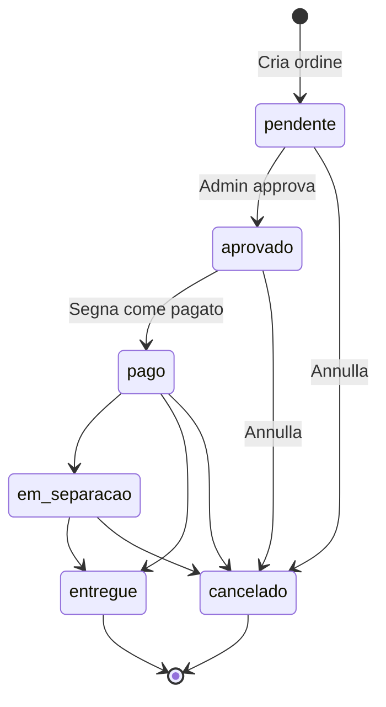

# Status Approvato e visibilidade de preços

## Fluxo proposto



- **In attesa (`pendente`)**: igreja cria o pedido; admin pode editar itens; preços visíveis só no admin.
- **Approvato (`aprovado`)**: admin confirma o pedido; preços são congelados; **total aparece na página pública** do pedido.
- **Pagato (`pago`)**: fluxo atual de baixa de estoque físico + documento PDF (sem mudança de lógica, só exige status `aprovado` em vez de `pendente`).

## 1. Banco de dados

Nova migration em [`supabase/migrations/`](supabase/migrations/):

```sql
ALTER TYPE public.pedido_status ADD VALUE IF NOT EXISTS 'aprovado' AFTER 'pendente';
ALTER TABLE public.pedido_itens ADD COLUMN IF NOT EXISTS snapshot_preco NUMERIC(12,2);
ALTER TABLE public.pedidos ADD COLUMN IF NOT EXISTS aprovado_em TIMESTAMPTZ;
```

Atualizar enum em [`src/integrations/supabase/types.ts`](src/integrations/supabase/types.ts) (`pedido_status` + campos novos).

## 2. Backend — aprovação e transições

Em [`src/lib/admin.functions.ts`](src/lib/admin.functions.ts):

**Novo `adminAprovarPedido`:**
- Valida `status === 'pendente'`.
- Carrega preços atuais dos produtos.
- Grava `snapshot_preco` em cada `pedido_itens`.
- Atualiza pedido: `status: 'aprovado'`, `aprovado_em: now()`.

**Ajustar `adminMarcarPago`:**
- Trocar guard de `pendente` para `aprovado` (mensagem IT: ordine non approvato).
- Restante inalterado (estoque físico, documento, PDF).

**Ajustar `adminCancelarPedido`:**
- Estornar reserva de `estoque_disponivel` quando status for `pendente` **ou** `aprovado` (hoje só `pendente`).

**Helper compartilhado** (ex.: `src/lib/pedido-status.ts`):

```ts
export const STATUS_COM_PRECO = ['aprovado', 'pago', 'em_separacao', 'entregue'] as const;
export function pedidoMostraPreco(status: string) {
  return STATUS_COM_PRECO.includes(status as typeof STATUS_COM_PRECO[number]);
}
```

Em [`src/lib/orders.functions.ts`](src/lib/orders.functions.ts):
- `buscarPedido`: incluir `snapshot_preco` nos itens quando `pedidoMostraPreco(status)`.
- Calcular e retornar `total_valor` apenas nesses casos (evita expor preço antes da aprovação).

## 3. Admin UI

Arquivos: [`src/routes/admin.pedidos.index.tsx`](src/routes/admin.pedidos.index.tsx), [`src/routes/admin.pedidos.$id.tsx`](src/routes/admin.pedidos.$id.tsx), [`src/components/StatusBadge.tsx`](src/components/StatusBadge.tsx).

| Onde | Mudança |
|------|---------|
| `StatusBadge` | `aprovado` → **"Approvato"** |
| Filtros mobile | Novo filtro "Approvati" |
| Kanban `COLUNAS` | `pendente → aprovado → pago → em_separacao → entregue → cancelado` |
| `TRANSICOES` | `pendente: ['aprovado','cancelado']`, `aprovado: ['pago','cancelado']` |
| Drop Kanban / `StatusSelect` | Drop em `aprovado` chama `adminAprovarPedido`; drop em `pago` mantém `adminMarcarPago` |
| Detalhe `/admin/pedidos/$id` | Em `pendente`: botão **"Approva ordine"** (substitui "Segna come pagato"); em `aprovado`: **"Segna come pagato"** + anular |
| Vista read-only admin | Mostrar **Totale** quando `pedidoMostraPreco(status)`, usando `snapshot_preco` |
| Form de edição (`pendente`) | Admin continua vendo preços/subtotais (sem mudança de regra) |

## 4. Catálogo e carrinho (público)

Arquivo: [`src/routes/catalogo.tsx`](src/routes/catalogo.tsx).

Conforme sua escolha (**preços unitários permanecem no catálogo**):

- **Cards do catálogo**: manter `formatPreco(p.preco)`; **remover** `{estoque} disp.` da UI.
- **Carrinho**:
  - Remover linha de preço por item (`€X × qty = €Y`).
  - Remover bloco **Totale** do footer.
  - Manter badge com quantidade de itens e controles de quantidade.
- **Validação interna**: [`src/lib/cart-store.ts`](src/lib/cart-store.ts) continua usando `estoque_disponivel` para limitar qty e o backend em `criarPedido` continua validando estoque — só não exibimos o número ao usuário.

## 5. Página pública do pedido

Arquivo: [`src/routes/pedido.$numero.tsx`](src/routes/pedido.$numero.tsx).

- Se `pedidoMostraPreco(pedido.status)`: exibir seção **Totale** com `total_valor` retornado por `buscarPedido`.
- Se `pendente` ou `cancelado`: lista de itens (nome + qty) sem total — como hoje.
- Itens individuais **sem** preço unitário na vista pública (só o total, conforme pedido).

## 6. O que não muda

- [`src/routes/meus-pedidos.tsx`](src/routes/meus-pedidos.tsx): já mostra só contagem de artigos, sem total.
- PDF/documento: gerado apenas em "pagato" (sem alteração).
- Share WhatsApp: sem preço na mensagem.

## Ordem de implementação sugerida

1. Migration + types
2. `adminAprovarPedido` + ajustes em marcar pago / cancelar
3. Labels, transições e Kanban admin
4. `buscarPedido` com total condicional
5. Carrinho/catálogo (UI)
6. Página pública do pedido com total pós-approvazione

## Testes manuais

- Criar pedido no catálogo: sem total no carrinho, sem "X disp." nos cards.
- Admin: editar em attesa → approvare → total visível em `/pedido/{numero}`.
- Tentar "Segna come pagato" antes de approvare → erro.
- Approvare → pagare → fluxo de documento/estoque físico intacto.
- Annullare em attesa e in approvato → reserva devolvida.
- Kanban: arrastar pendente→aprovado→pago.
